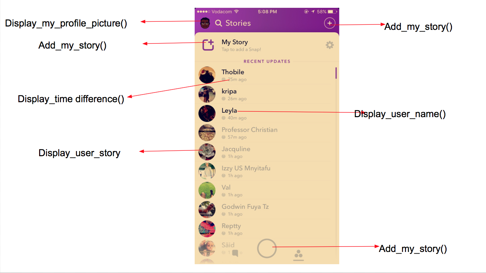

# iX-iOS homework day 1
## Ally Mahmoud, June 26th 2017
### 

### MVC Structure! 🏗 of the Snapchat main story board 

#### 1. Snapchat main story board *MODEL*


```java

//model of the snapchat main story board
public class Snapchat_user {
    private String name;
    private String snapchat_iD;
    private Image profile_picture;
    private Timestamp time_stamp;
    private String relationship; //follower, following, or mutual
    private String password;

    //getters
    public String get_name() {
        return name;
    }
    public String get_snapchat_iD() {
        return snapchat_iD;
    }
    public Timestamp get_time_stamp() {
        return time_stamp;
    }
    public String get_relationship() {
        return relationship;
    }
    public Image get_Image() {
        return profile_picture;
    }
    public String get_password() {
        return password;
    }


    //setters
    public String set_name( String name) {
        this.name = name;
    }
    public String set_snapchat_iD(String snapchat_iD) {
        this.snapchat_iD = snapchat_iD;
    }
    public Timestamp set_time_stamp(Timestamp time_stamp) {
        this.time_stamp = time_stamp;
    }
    public String set_relationship(String relationship) {
        this.relationship = relationship;
    }
    public Image set_Image(Image profile_picture) {
        this.profile_picture = profile_picture;
    }
    public String set_password( String password) {
        this.password = password;
    }

} 
```

#### 2. snapchat main story board *VIEW*




#### 3. snapchat main story board *CONTROLLER*


```java

Display_my_profile_picture();
Add_my_story();
Display_time difference();
Display_user_story;
Display_user_name(); 
```

 


